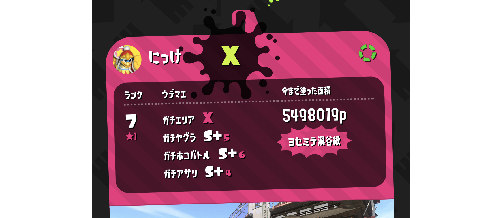

# 棚卸し(2019 年 1 月)

React Native / Vue.js / Ruby on Rails / Design / Splatoon2 / Reading

定期的にやるやつ。前回のはこれ 👉 [棚卸し(2018 年 10 月)](https://medium.com/35d/%E6%A3%9A%E5%8D%B8%E3%81%97-2018%E5%B9%B410%E6%9C%88-2f684ee2e995)

## React Native

相変わらず仕事もプライベートも React Native ばかり書いている。

昨年末に仕事で書いたブログ『[React Native でアプリ開発をして良かったところ・ツラかったところ](https://tech.bizreach.co.jp/posts/300/react-native/)』がはてぶ 50 を超えてちょっとだけ PV がついたりした。

プライベートは bukumo.jp の iOS アプリ版の開発に着手した。『[React Native で Bukumo の iOS アプリ版を作り始めた](https://medium.com/35d/react-native-%E3%81%A7-bukumo-%E3%81%AE-ios-%E3%82%A2%E3%83%97%E3%83%AA%E7%89%88%E3%82%92%E4%BD%9C%E3%82%8A%E5%A7%8B%E3%82%81%E3%81%9F-40f181014300)』というブログを書いて、インターネット上に自分の活動を宣言することで自分の首を締めることにした。3 月末あたりを目標に開発を進めたい。

## Vue.js

個人開発の Web サービスで使っている。スプラトゥーンのプロフィールが作れるサービスや、[自身のインターネット上でのアカウントをまとめた Web ページ](https://35d.jp/#)を Vue.js で作った。ほぼペライチだけど書き味がとても良くて好き。小要素へのイベントの伝播を止める click.self を最近知ったりして、こういうかゆいところに手が届く素敵なライブラリだなと思っている。これからも小規模な Web アプリケーションを作るときには積極的に使っていくと思う。

Vue.js とは直接関係はないけど、上記のアプリケーションで Parcel と Netlify を初めて使った。とても便利でビックリ。こういう自動化どんどん進めばいいね。

- [Parcel + Vue.js + Netlify で静的ページを作ってデプロイするまで【Parcel 編】](https://medium.com/35d/parcel-vue-netlify-1-2987787e5961)
- [Parcel + Vue.js + Netlify で静的ページを作ってデプロイするまで【Netlify 編】](https://medium.com/35d/parcel-vue-netlify-2-5c0cbc43d055)

## Ruby on Rails

上記のアプリの Web API の開発は Ruby on Rails でしている。昨年リリースした [Bukumo](http://bukumo.jp/) のコードに足りない API を追加で開発するようにしているので触れる機会は少ないが、たまに追加を試みると自分の 1 年前のコードが嫌でも目に入ってくる。日々精進していきたい。

## Design

あまり言及することはない。いままでずっと Adobe XD を使い続けてきたが、 Figma を使ってみることにした。今後デザインに触れる機会はだんだん減っていきそう。

- [Figma](https://www.figma.com/)

## Splatoon2

ガチエリアがウデマエ X で、それ以外がウデマエ S+という状態。すべてのルールでウデマエ X になるべく奮闘中。いまいちばん好きなブキはデュアルスイーパー。[YouTube の動画](https://www.youtube.com/channel/UC9DyjyQZBL74H7nCT3eG0Rg?view_as=subscriber)も定期的にあげていきたい。今年はチャンネル登録者数増やしたい気持ち。

## Reading

読んだ本。どちらもけっこう良かったのでオススメ。

- [エンジニアリング組織論への招待 ~不確実性に向き合う思考と組織のリファクタリング](https://www.amazon.co.jp/dp/4774196053/ref=as_li_ss_tl?coliid=I16I3CNFNT3L8E&colid=END721OJDT0H&psc=0&ref_=lv_ov_lig_dp_it&linkCode=ll1&tag=nikke01-22&linkId=d35bef0d3d02dff8e8024aee7ea33e57&language=ja_JP)
- [メモの魔力 The Magic of Memos (NewsPicks Book)](https://www.amazon.co.jp/dp/4344034082/ref=as_li_ss_tl?coliid=I11NM1YULNUAML&colid=END721OJDT0H&psc=0&ref_=lv_ov_lig_dp_it&linkCode=ll1&tag=nikke01-22&linkId=856a350e7e01eb7018d826681693541a&language=ja_JP)

### さいごに

また 3 ヶ月後くらいに書きます。
