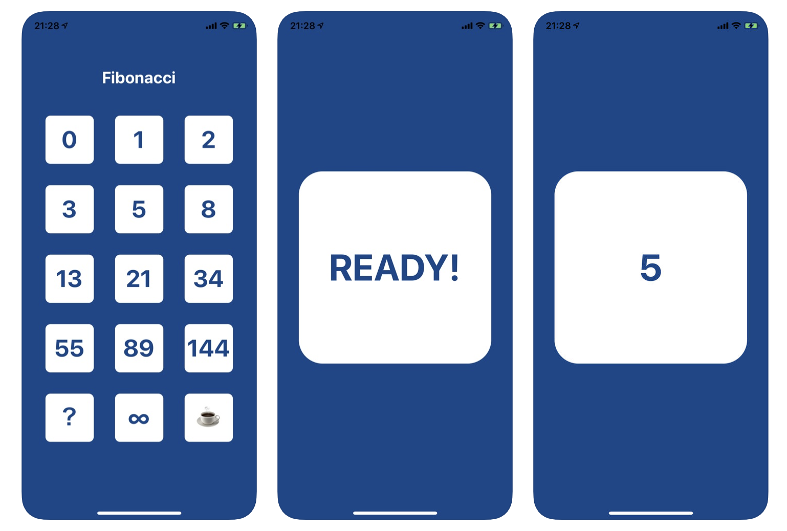
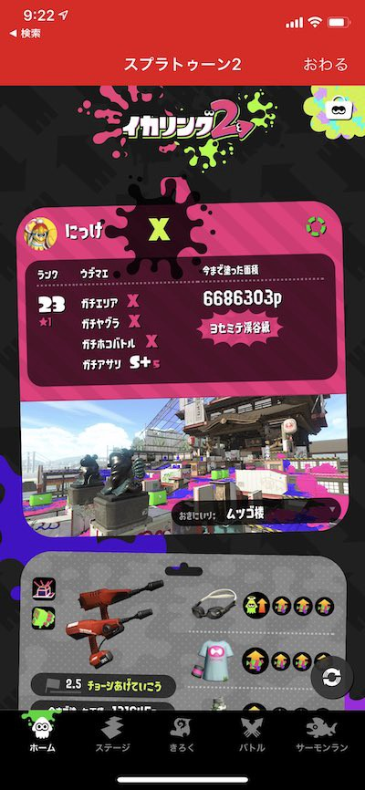

<PostTop />

# 棚卸し(2019 年 4 月)

定期的にやるやつ。

## React Native

会社での React Native のプロジェクトが一段落しました。

ここ 3 ヶ月ほど、ビズリーチ・キャンパス for Student の Android アプリの開発をしており、それが先日無事リリースできました。正直ホッとしています。これで iOS と Android の両プラットフォームに対応できたことになりました。思ったより長い道のりだったなあって感じですが、同一コードで両プラットフォームで動く React Native の良さがようやく出たかなと思いました。技術的な話はそのうち別の記事で書きたい気持ちです。

[ビズリーチ・キャンパス for Student](https://play.google.com/store/apps/details?id=jp.bizreach.campus.candidate)

## Expo (React Native)

プライベートでも React Native 製の iOS アプリを 1 個リリースできました。会社の同僚の [Naoya Kurahashi](https://twitter.com/entrepont12) と一緒に開発しました。はじめて Expo を使って開発をしたのですが、開発体験は良さに感動しました。軽量アプリなら Expo で良いですね。これについては別途記事を書こうと思います。
[プランニングスクラムポーカー](https://itunes.apple.com/jp/app/%E3%83%97%E3%83%A9%E3%83%B3%E3%83%8B%E3%83%B3%E3%82%B0%E3%82%B9%E3%82%AF%E3%83%A9%E3%83%A0%E3%83%9D%E3%83%BC%E3%82%AB%E3%83%BC/id1454230109?mt=8)

ちなみに作ったのは 👆 のアプリで、スクラム開発で使うプランニングポーカーという見積もり用のやつ。スクラム開発を導入してるチームのみなさん、ぜひインストールして使ってあげてください。フィードバックもお待ちしています。

## Library (React Native)

ハーフモーダル用の自作ライブラリを作り始めて、ちょこちょこスターが付き始めました。これに関しても別途記事を書きます。
[35d/react-native-half-modal](https://github.com/35d/react-native-half-modal)

## Ruby on Rails

テストに関心があり Rails 上での RSpec の勉強をしました。それ以外に技術的なチャレンジは全然できていないです。後述する [indies.band](http://indies.band) というサービスのグロースのための開発をたまにしています。

## Splatoon2 / YouTube

さいきんけっこうな時間を割いています。昨日ようやくガチアサリ以外ウデマエ X になりました。今いちばん好きなブキはプライムシューターベッチュー。[YouTube の動画](https://www.youtube.com/channel/UC9DyjyQZBL74H7nCT3eG0Rg?view_as=subscriber&sub_confirmation=1)も定期的にあげていきたいと思っていて、今年のテーマの一つです。もし良かったら[チャンネル登録](https://www.youtube.com/channel/UC9DyjyQZBL74H7nCT3eG0Rg?view_as=subscriber&sub_confirmation=1)と高評価お願いします 🙏

  
_2019/04/13 時点でのウデマエ進捗_

## indies.band

2 年ほど前に作った [indies.band](http://indies.band) というサービスのグロースを再開しました。ちまちまと営業とマーケティング活動をやっています。知名度がないバンドが、世の中にもっと広まればいいなと思って作ったやつです。

## できていないこと

- Bukumo の iOS アプリの開発を完了させることはできませんでした。やり切る力が足りませんでした……
- 技術的なチャレンジがあまり出来ていません。機会を見つけて何か習得したい気持ちです。。。GW 何か作るか。。。
- 本が全然読めていません。時間をうまく使えてない証拠。
- 一人になる時間がうまく取れませんでした。会社で本格的なスクラム開発が始まって 3 ヶ月ほど。内省型の自分としては、一人でじっくり考える時間をうまく取ることが最近できておらず、うまく思考が回せていない実感があります。直近の課題かなと思ってるのでなんとかしたいです。

<blockquote class="twitter-tweet">
一人になれる時間が自分にとって大切だって分かってるんだけど、うまく時間捻出できなくてダメだ。
&mdash; Yuji Tsuburaya (@___35d) <a href="https://twitter.com/___35d/status/1115657644717404160?ref_src=twsrc%5Etfw">April 9, 2019</a></blockquote> 

## さいごに

また 3 ヶ月後くらいに書きますね。

- [棚卸し(2018 年 1 月)](https://medium.com/35d/%E6%A3%9A%E5%8D%B8%E3%81%97-2019%E5%B9%B41%E6%9C%88-83092df1f47e)
- [棚卸し(2018 年 10 月)](https://medium.com/35d/%E6%A3%9A%E5%8D%B8%E3%81%97-2018%E5%B9%B410%E6%9C%88-2f684ee2e995)
