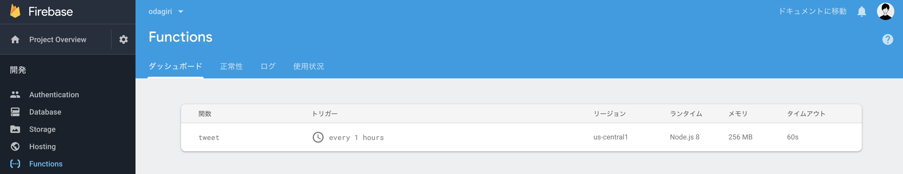

# Firebase だけで cron が実行できるようになったので Twitter bot を作ってみた

](https://cdn-images-1.medium.com/max/2732/1*_SnS4SKdCQRnxtVdOlbmWA.png)_Illustration by [unDraw](https://undraw.co/illustrations)_

2019 年 4 月くらいから Firebase だけで cron が実行できるようになったとのことなので、早速使ってみました。今までは Google Cloud Function を組み合わせて、Pub / Sub エンドポイントに定期的にリクエストを飛ばすような仕組みを作らなければならなかったのが、Firebase の設定だけでできるようになりました。超便利。

> However, solutions that involve the invocation of an HTTP function aren’t fully secure, because the HTTP endpoint URL is effectively public and accessible to anyone who knows that URL.

firebase の開発ブログにも、今までのやり方だとエンドポイントが公開されてるから(たしか予測しづらい URL にはなっていた気がする。よはいうものの)、完全には安全じゃないよって書いてあったりします。

[https://firebase.googleblog.com/2019/04/schedule-cloud-functions-firebase-cron.html](https://firebase.googleblog.com/2019/04/schedule-cloud-functions-firebase-cron.html)

### 作り方

ざっくりこんな流れです。

1. Firebase のプロジェクトを準備して、blaze プラン(従量課金)に変更

1. Twitter の開発者登録をして、API キーを取得

1. コードを書いてデプロイ

**「コードを書いてデプロイ」について補足**

1 と 2 はドキュメントを読みながら進めればできると思うので割愛して、3 について少しだけ詳しく説明します。ざっくりと書くと、以下のようなコードを書いてデプロイすれば Firebase に定期実行のジョブが登録されます。schedule の引数で定期実行の間隔をします。定期実行の間隔の指定の仕方は[こちらのドキュメント](https://cloud.google.com/appengine/docs/standard/python/config/cronref)を参考にすると分かりやすいです。

    exports.tweet = functions.pubsub.schedule('every 1 hours').onRun(async context => {
      // 実行したいもの
    });

実行したいもののところに任意のコードを書けば OK です。今回は、ツイート bot を作ったので、以下のようなコードになりました。ライブラリは[こちら](https://www.npmjs.com/package/twitter)を使用しました。

    try {
      const client = new Twitter(twitter_credentials);
      await client.post('statuses/update', { status });
    } catch (error) {
      throw error;
    }

コンソールで以下のコマンドを叩けばデプロイ完了です。

    firebase deploy --only functions

デプロイに成功すると、Firebase コンソール上に定期実行のジョブが登録されます。schedule した期間がトリガーとなっていることが分かります。

### なに作ったの？

1 時間に 1 回自動でツイートする Twitter bot を作ってみました。オダギリ・ジョーという文字列をアナグラムでランダム投稿するという超くだらない bot です。~~もし良かったらフォローしてやってください。~~ (削除済み)

_オダギリ・ジョー bot (現在は削除済み)_

**😭 デプロイできないときに試すこと**

`firebase deploy` でデプロイできなくて 1 時間ほどハマってました。 `firebase-cli` のバージョンが古くてデプロイできなかった模様でした。 7.2.2 までバージョン上げたらデプロイできるようになったので、デプロイできない方は試してみてください。

(エラーがとにかく不親切で 404 エラーがずっと出てたので別の原因かと思ったら、バージョン問題だったというオチ。404 エラー出たら 👆 のやつを疑ってみてください。僕と同じツラミを味わう人が減りますように。)
