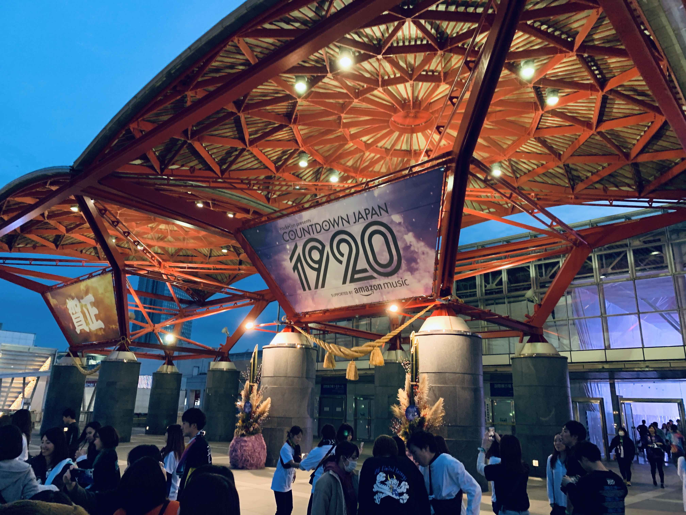
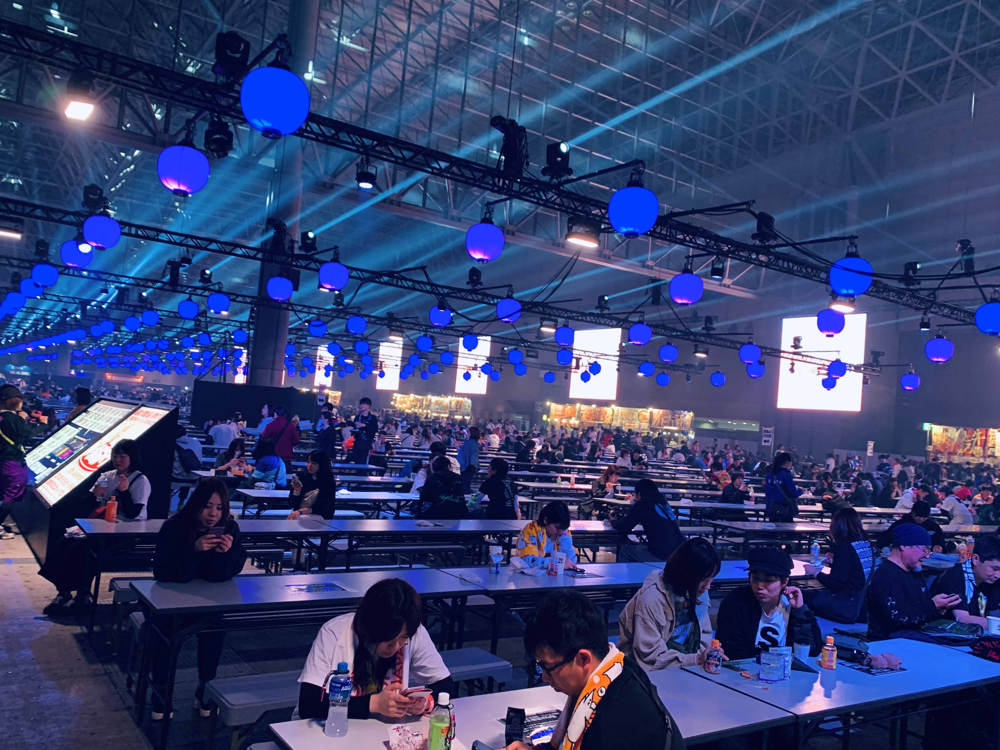

# カウントダウンジャパン 4 日通し

まだ 3 日目の夜ですが、今年も 4 日通しでカウントダウンジャパンに行ってます。  
ここ 3-4 年くらいはずっと 4 日通しで行っていて、もはや年末の風物詩みたいになってます。  
これがあって年末だなあという気持ち。

<blockquote class="twitter-tweet">
生まれて初めて NUMBER GIRL を生で見た。
&mdash; Yuji Tsuburaya (@___35d) <a href="https://twitter.com/___35d/status/1211591132456443904?ref_src=twsrc%5Etfw">December 30, 2019</a></blockquote> 

## 初日

だいぶ遅刻して行ってしまって、みたいバンドが見れなかったりしました。Creepy Nuts がホント良かったので、みんなもライブで見てほしい気持ち。音源の 100 倍良かったです。

King Gnu / Official 髭男 dism / Nothing's Carved In Stone / Creepy Nuts

## 2 日目

見たいバンドが被ってて泣く泣く、みたいなパターンが多い一日でした。この日は動くのが多くてけっこう疲れました。清水ミチコが面白すぎました……

9mm Parabellum Bullet / 04 Limited Sazabys / ORANGE RANGE / フレンズ / 清水ミチコ / MAN WITH A MISSION / ASIAN KUNG-FU GENERATION

## 3 日目

夕方から幕張メッセへ。ナンバガを初めて見ました。元気な向井秀徳が見れて良かったです。

NUMBER GIRL / サカナクション

## 最終日

見る予定のバンド。力尽きたら帰る予定。

クリープハイプ / ヒトリエ / Lucky Killimanjaro / おいしくるメロンパン / CUPSULE / 10-FEET / THE ORAL CIGARETTES / POLYSICS / go!go!vanillas / m-flo / FINLANDS / ずっと真夜中でいいのに

明日はブログが書けないので、これが年内最後のブログになりそうです。  
今年もお世話になりました。来年もよろしくお願いします。良いお年を〜〜〜。

