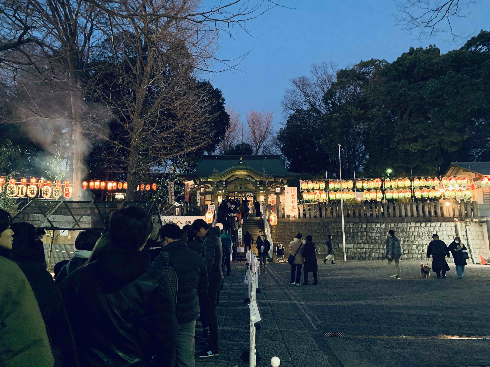

<PostTop />

# 初詣・テラスハウス・鬼滅の刃

新年あけましておめでとうございます。今年もよろしくお願いします。

## 初詣

カウントダウンジャパンから明け方に帰宅して、昼間で寝て、昼過ぎから近所の神社へ初詣に行ってきました。極寒の中、半分意地になりながら 1 時間以上の行列に並び（こんなに混んでるのは想定外だった）、なんとかお参りを済ませて来ました。今年も良い年になると良いなの気持ちです。

## テラスハウス

#3-28 を見ました。新しく入ってきたトパス君が何かしでかしそうで、見ててハラハラする回でした。もしかしたら僕の歴代の好きな人ランキング上位に入るかもしれない……ちなみに今まで好きだったのは、半さん、ペッペ、翔平くん、あたりです。

## 鬼滅の刃

今更ですが、「鬼滅の刃」の漫画を読み始めました。Kindle でまとめ買いはしていたものの、積まれた状態になっていたのを、カウントダウンジャパンの移動時間を利用して読み始めたら止まらない止まらない。仲間が増えたあたりから一気に面白くなりますね。修行回なんかは、HUNTER×HUNTER のビスケとの修行を彷彿とさせるワクワク感がありました。今 8 巻(無限列車編あたり)を読んでるので、早く最新話まで追いつきたいです。

読まず嫌いの人は騙されたと思って 3 巻まで読んでみてください。

[鬼滅の刃 (全 19 巻) Kindle 版 まとめ買い](https://amzn.to/2u7t1CB)

---

今年は読んだ本とかもしっかり記録に残していきたいなと思います。
