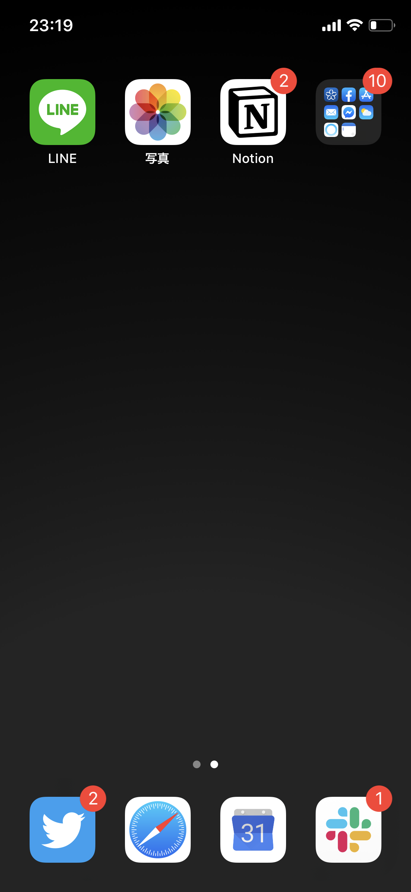

<PostTop />

# ホーム画面（2019 年 1 月）

定点観測。

### ホーム画面

- LINE
- 写真
- Notion
- フォルダ

### ドック

- Twitter
- Safari
- Google カレンダー
- Slack

_グラデが綺麗に描画されない_

---

これ使うと、ドック(？)との境目を消せるのでオススメ。

[https://heyeased.weebly.com/almost-all-black.html](https://heyeased.weebly.com/almost-all-black.html)
