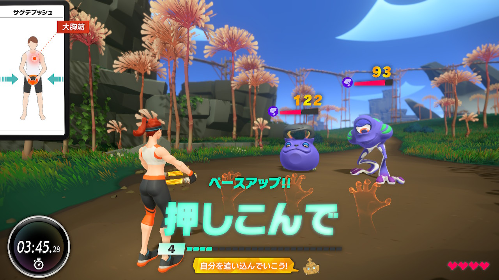

# リングフィットアドベンチャー 7 日目

年末に運良く Amazon に入荷していたタイミングで購入できて、（ほぼ）毎朝リングフィットアドベンチャーをやってます。朝起きて、水を汲んで、リングフィットアドベンチャーをやるのがルーティンになりつつあって、とても良い傾向だなと思います。

<blockquote class="twitter-tweet">
9:00 起床 リングフィットアドベンチャー お風呂 10:00 オンラインミーティング 12:00 ランチ 13:00 出社＆実装  なんか素晴らしい年末最終勤務日な気がしてきた。
&mdash; Yuji Tsuburaya (@___35d) <a href="https://twitter.com/___35d/status/1210436045696684032?ref_src=twsrc%5Etfw">December 27, 2019</a></blockquote> 

上半身の筋肉が極端に少ないので、意識的にアゲテプッシュ・サゲテプッシュあたりを中心に戦いを組み立てて、ストーリーを進めています。（疲れたら椅子のポーズに逃げるｗ）今朝で 3 面のボスの直前くらいまで進みました。毎日ストーリーを 1,2 ステージ進めるのと、それとは別に、気が向いたら姿勢改善トレーニングをしています。

毎日 0.5 ~ 1h くらいずつをちょこちょこやるスタイルなので（というか負荷高くてそれくらいが限界）、あまりストーリーは進んでいかないですが、クリアするまでは飽きずに続けられそうな気がしています。前に購入したフィットボクシングは飽きてすぐにやめてしまったので。

継続してやっていき 💪

[リングフィットアドベンチャー Amazon](https://amzn.to/37qfPai)
