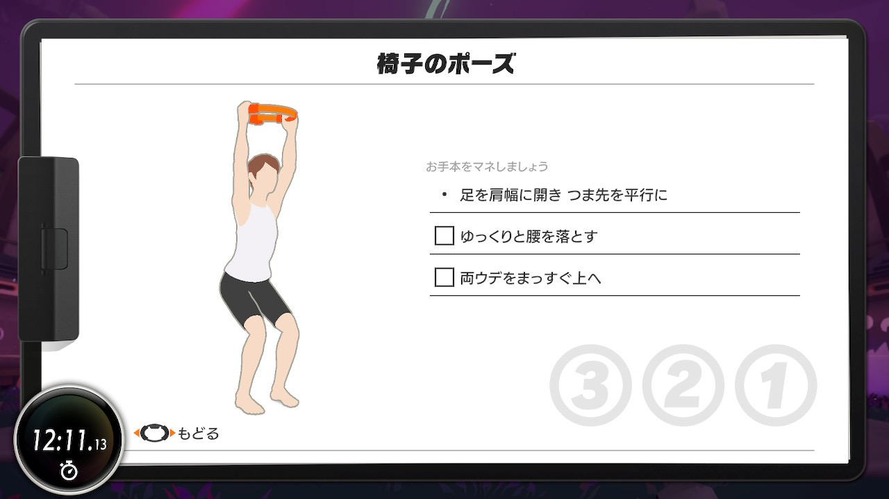

# リングフィットアドベンチャー 9 日目

リングフィットアドベンチャー 9 日目のプレイ。ステージ 3 ボスのドラコ戦。
途中、腹筋ガードが一回漏れてしてまって、ワンパンで倒されるという事件があったものの、なんとか 2 回目で勝利。

スムージー飲みきったあとに体力回復できる攻撃仕掛けてきて「マジか……」ってなりました。

_体力が多すぎて、途中ちょっと椅子のポーズに逃げた_

今日もバンザイプッシュを中心に、疲れたら英雄のポーズとか椅子のポーズで休憩しつつ戦いました。個人的にバンザイプッシュがイチバンキツいので、そのあたりを鍛えるべく、継続してやっていきたい気持ちです。
