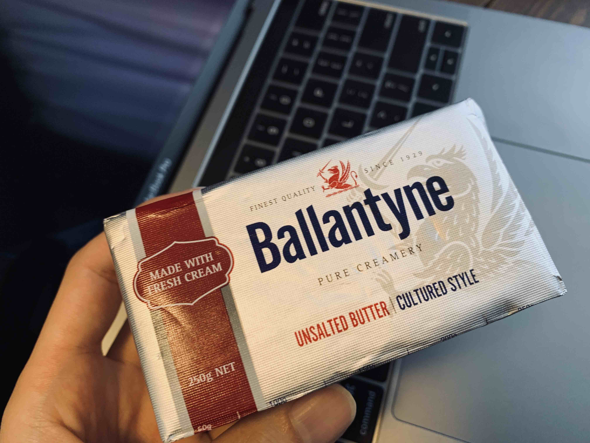
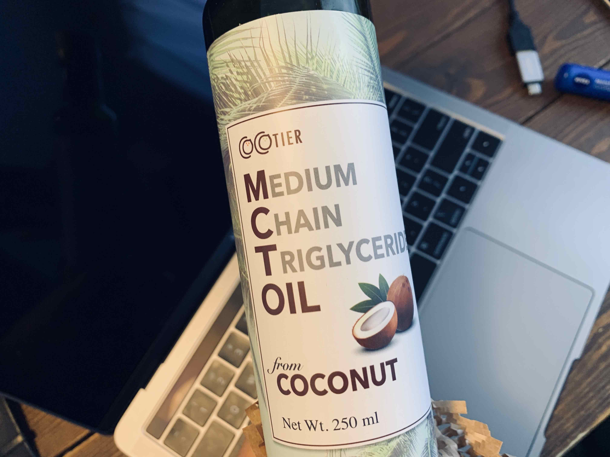

<PostTop />

# バターコーヒー生活はじめました

年末から朝にバターコーヒーを飲むという生活をはじめました。毎朝、朝食を食べる代わりにバターコーヒーを飲んでいます。
お昼にお腹すくし、ちょうど良い感じで、健康にも良い気がしています。

_バターコーヒー_

材料は、ほぼ KALDI で揃えました。

_無塩バター_

_MCT オイル_

無塩バターは、10g ずつで予めカットしておいて、サランラップで巻いて保存しています。毎朝カットする手間を省いています。
バターを電子レンジで溶かして、オイルと淹れたコーヒーをミルク泡立て器で混ぜて完成です。慣れてくると 10 分くらいで作れるようになります。

コーヒー豆はスタバで買ったやつを適当に使っています。どのコーヒー豆が相性良いかはまだ探り中です。（相性良いやつ、教えて下さい）
酸味強いやつは相性悪いなっていうところまで分かりました。酸味強い豆で作ると普通にマズい 🤮

ミルク泡立て器は Amazon で適当に買いました。

[IKEA(イケア) PRODUKT 70301165 ミルク泡立て器 ブラック](https://amzn.to/2rTDu3O)

バターコーヒーオススメなのでみなさんもぜひ。相性良いコーヒー豆あったら教えて下さい。
