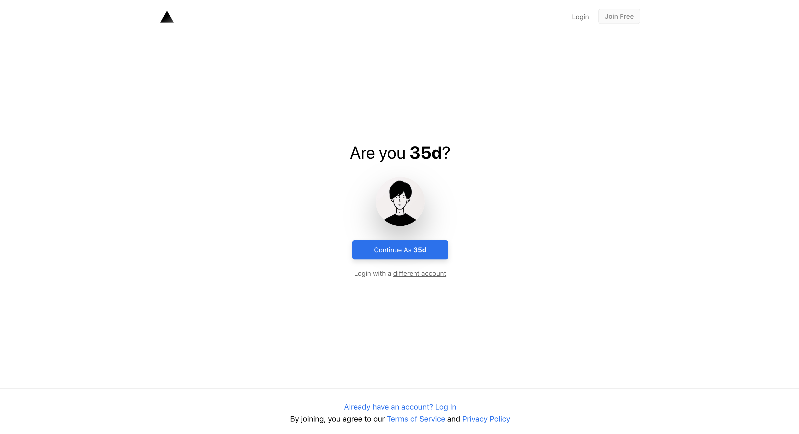
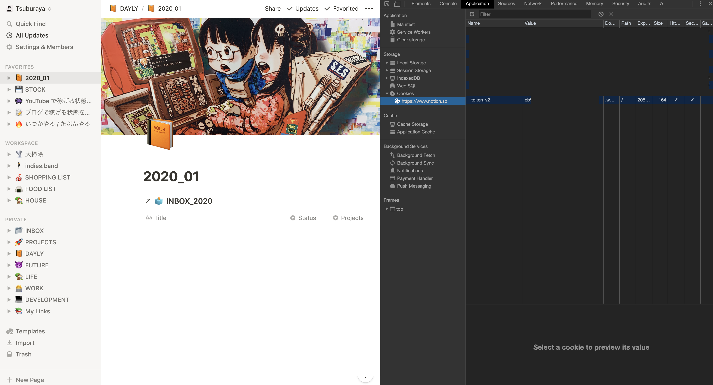
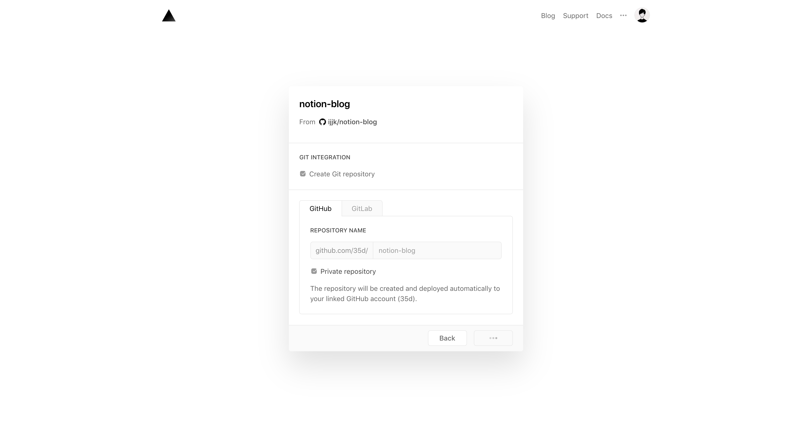
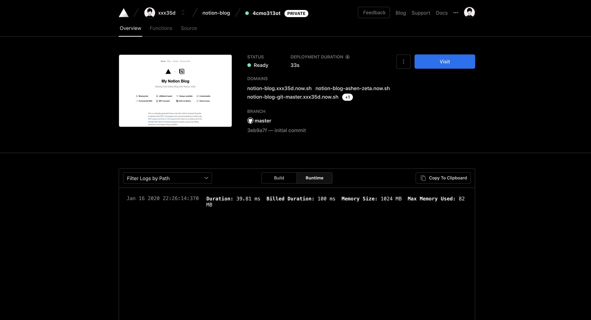
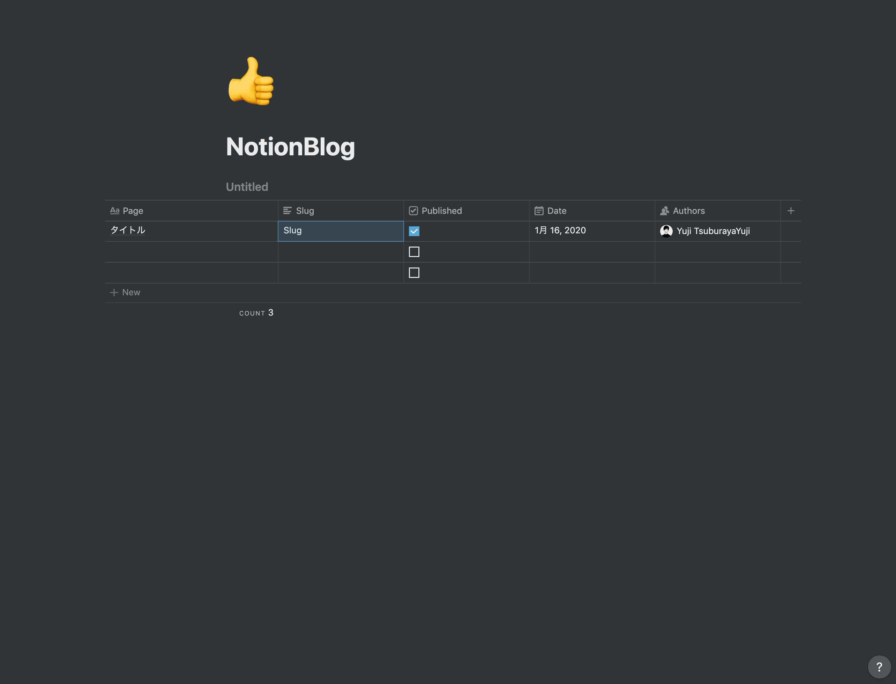
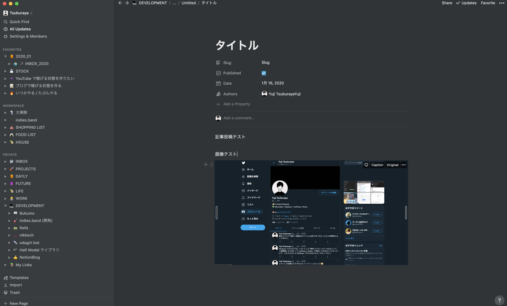
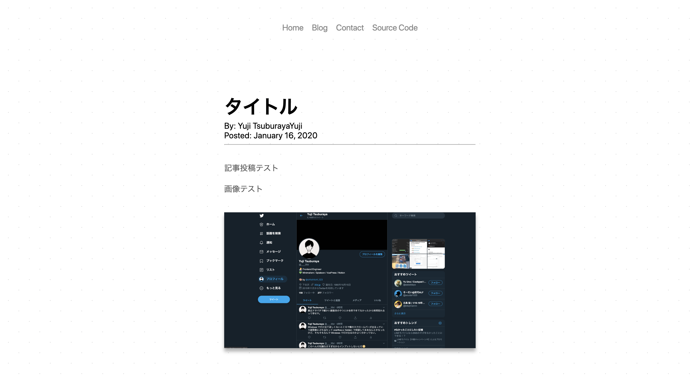

# Notion Blog を使って、いま最もモダンなブログ環境を構築する

会社の後輩に Notion Blog というものの存在を教えてもらったので試し切りしてみました。
Notion Blog は Notion をバックエンドにしたヘッドレス CMS で、コンテンツの入稿が Notion でできると言う素晴らしいものです。
実際に触ってみたのですが、環境構築も一瞬で終わり、Notion で記事を書いて公開するまで 10 分程度でいけました。
（ビュー部分はテンプレートとして準備されているものを使用しました。）

## Notion Blog でできること

- Notion で記事の編集・公開が可能でした
- デプロイも自動 (Notion 編集後、30 秒くらいで自動で記事が公開されました)
- GitHub に作ったリポジトリで、スタイルも自由にいじれそうでした

## 環境の作り方

⚠ 前提条件は以下になります

- Notion のアカウントがあること
- GitHub のアカウントがあること

[Notion Blog](https://notion-blog.now.sh/) にアクセスして始めていきます。

Zeit のアカウントがなかったので、新規にアカウントを作成しました。GitHub 連携で作りました。

アカウントを確かめられるので、正しければそのまま進みます。

スクショ撮り忘れてしまったのですが（すみません）、*Notion のトークン*と、_記事 ID_ の入力が求められるので、入力フォームにそれぞれ入力していきます。
Notion のトークンはクッキーに格納されているので、ブラウザで Notion を開いて、スクショの部分の `token_v2` というところの値をコピーして貼り付けます。

また、記事 ID は Notion でブログにしたいドキュメントの URL から取得します。今回は新しく NotionBlog というドキュメントを作成しました。
作成すると、URL が`https://www.notion.so/35d/NotionBlog-XXXXXXXXXXXXXXXXXXXXXXXXXXX` のような形になるので、 `XXX` の部分を記事 ID として貼り付けます。

GitHub でリポジトリを作成するか尋ねられます。ブログをカスタマイズしたいので、リポジトリを作成しました。

設定は以上で、もろもろ設定が完了すると、最初のデプロイが行われます。管理画面上で、デプロイ先の URL が表示されるので、そこにアクセスすると、そのページが自分のブログになっています。

また、Notion 上には Notion Blog の雛形が出来上がっています。ここにドキュメントを追加していくことで記事が公開されていきます。
公開フラグもデフォルトで準備されており、フラグを折っておくことで下書き状態でブログを書くことができそうです。

このように Notion 側で記事を編集すると、

ブログの方では全く同じ状態で公開されます。画像とかもドラッグ＆ドロップで Notion 上にアップロードできて、とても簡単……素晴らしすぎる……

## まとめ

- Notion Blog メチャメチャ便利そう

---

おとといリリースされたばかりなので、インターネット上にまだあまり知見はなさそうですが、新しくブログを作りたいという人の選択肢としては Notion Blog メチャメチャありだと思いました。
（僕は VuePress を使ってブログを作ってしまったのでもうさすがに移行しないですが、もうちょっと前だったらこれ使ってたかも……）

<blockquote class="twitter-tweet">
Notion Blog 試してみたけどスゴイな、Notion に書いたブログがリアルタイムで Blog 記事として反映される。左がデプロイされたブログで、右が僕の Notion の画面。 <a href="https://t.co/gYOOZBfmjw">pic.twitter.com/gYOOZBfmjw</a>
&mdash; Yuji Tsuburaya (@___35d) <a href="https://twitter.com/___35d/status/1217802297629011969?ref_src=twsrc%5Etfw">January 16, 2020</a></blockquote> 
