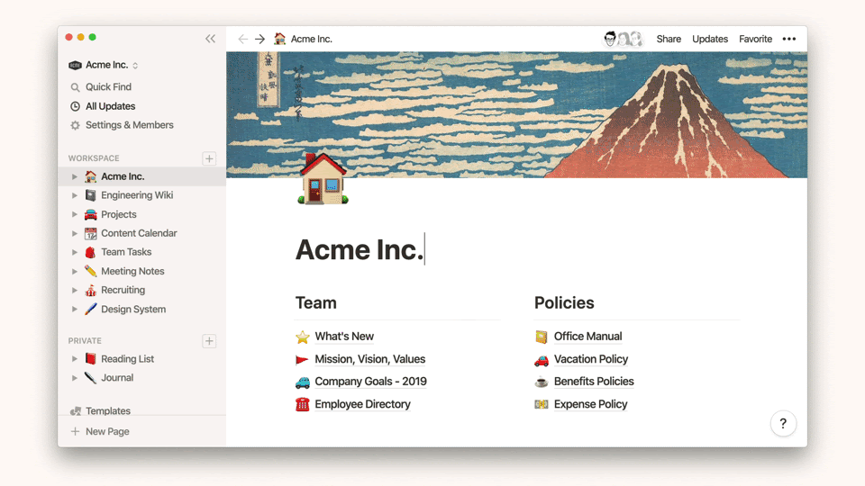

# Notion v2.7 リリース。Quick Find 機能のカイゼン等

<blockquote class="twitter-tweet">
Notion からアップデートのお知らせ届いてた。検索機能のカイゼンとかが入ったっぽい。 <a href="https://t.co/3V8aMFGEW2">pic.twitter.com/3V8aMFGEW2</a>
&mdash; Yuji Tsuburaya (@___35d) <a href="https://twitter.com/___35d/status/1217235472927186944?ref_src=twsrc%5Etfw">January 15, 2020</a></blockquote> 

僕の大好きな Notion にアップデートがありました。v2.7 のリリースです。大きな目玉は、Quick Find 機能の改善。タイトルでの検索や、検索結果のフィルタリングができるようになりました。Quick Find 機能は `Command + P` で使用することができます。

詳しい Quick Find 機能の説明は、以下の公式ドキュメントから。

[Searching with Quick Find](https://www.notion.so/Searching-with-Quick-Find-af945b6e69b64437afba2d143e4b546f)

他にも、全体的な安定性の向上や、パスワード機能、SSO（シングルサインオン）機能などのアップデートが入ったみたいです。

---

これから、好きなソフトウェアをどんどん布教していくぞの気持ちで、Notion の発信を多めに頑張っていこうと思っているので、よろしくお願いします。メチャメチャ便利なので、ぜひみなさんも Notion 使ってみてください。

[https://www.notion.so/](https://www.notion.so/)
