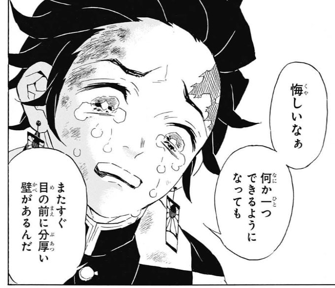

# 鬼滅の刃・波よ聞いてくれ

最近読んだ漫画たちのお話です。

「鬼滅の刃」は Kindle でまとめて買ってあり、今日ようやく 9 巻まできました。遊郭で鬼探しをしているところらへんです。
最初アニメの 1 話を見た限りでは微妙だな〜と思っていたのですが、読み進めるとホント面白い。人気出るのも分かりますわ……
読んだことない人は、漫画、騙されたと思って 3 巻くらいまで読んでみてください 🙌 ぜひ！

名シーンも出てきました。

---

「波よ聞いてくれ」は 7 巻。
前回から間が空きすぎて 6 巻がどういう話だったのか、正直なところ忘れてしまっていたのですが、
7 巻も笑わせてくれました。シリアスなのに、相変わらずシュールな笑いがこみ上げてくる感じでした。
ネタバレですが、作中、最後に大きな地震があり（北海道地震をモチーフにしたもの）、今後の展開がどうなっていくのか非常に楽しみです。

どちらもオススメの漫画なのでぜひ〜。

[鬼滅の刃 全巻セット Amazon](https://amzn.to/2sCC0vi)  
[波よ聞いてくれ(7) Amazon](https://amzn.to/30sTDdk)
