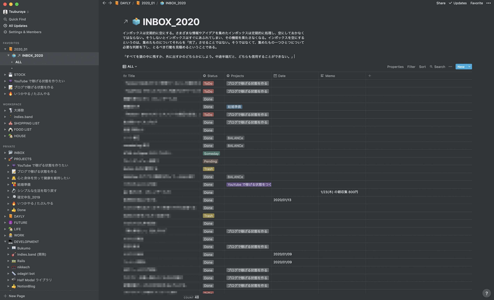
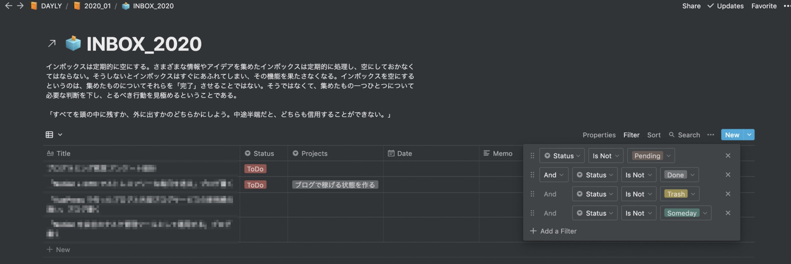
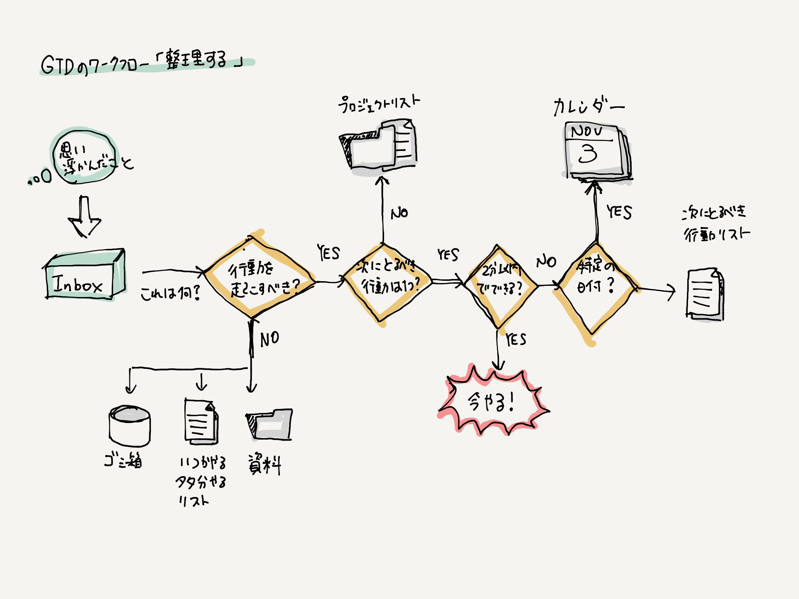
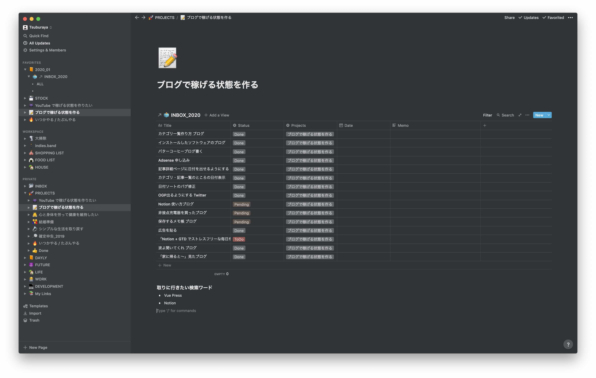

# Notion + GTD でストレスフリーな生活を手に入れる

「Notion どんな感じで使ってるんですか？」と聞かれることが割と多くなってきたので、今の運用をブログにまとめておこうと思い、この記事を書き始めました。

僕は、タスク管理・ストック情報・思考の整理・アイデアなど、自分に関する情報を全て Notion にまとめています。
また、5 年ほど前（大学生時代）から GTD と呼ばれるタスク管理手法を使っており、現在は Notion と GTD を組み合わせて運用しています。
大学生時代は Evernote + GTD で運用してきたのですが、昨年、一念発起し、Evernote から Notion へのお引越しを決行。
それ以来 Notion にドハマリし、いろんな会社に Notion を導入したり、いろんな人に Notion を勧めたりしています。
今日は、Notion の主な使用方法の一つである、タスク管理についての話を、 GTD と絡めてしていきたいと思います。

## そもそも GTD って？

> 「GTD」とは「Getting Things Done」の略称で、「ものごとをやり遂げる」ことと、「私たちの頭をいかにクリエイティブな活動に使うか」ということに焦点を当てています。GTD を実践することで、生産性の向上はもちろん、一般的なタスク管理では難しい、創造性の向上も目指せるはずです。
>
> [GTD JAPAN より引用](http://gtd-japan.jp/about)

GTD の核となるのが、INBOX です。頭の中にある全てのことを外（INBOX）に吐き出し、
頭の中を空にすることで、以下のような効果が期待できます。

- 集中力の増加
- 本当に大切なことへのフォーカス

<blockquote class="twitter-tweet">
GTD の本に書いてある「すべてを頭の中に残すか、外に出すかのどちらかにしよう。中途半端だと、どちらも信用することができない。」っていう一節が好きで。自分に何度も何度も言い聞かせるようにしてる。
&mdash; Yuji Tsuburaya (@___35d) <a href="https://twitter.com/___35d/status/1218422942779895809?ref_src=twsrc%5Etfw">January 18, 2020</a></blockquote> 

⚠ この記事では、紙面の都合上、GTD についての全ての説明はできないので、
断片的な知識を繋げる意味も込めて以下の本を読んで一度、体系的にインプットすると良いかと思います。

[全面改訂版 はじめての GTD ストレスフリーの整理術 | Amazon](https://amzn.to/2NDSt9N)

## Notion とどう組み合わせるの？

前置きが長くなってしまいましたが、僕のプライベートの Notion のスクリーンショットを撮ってきました。文字で説明するよりは実際に見てもらった方が早いかと思います。

このように Notion のテーブル機能を使って INBOX を作成しています。
INBOX の一個一個の要素が頭に浮かんだこと（ここでは便宜上「タスク」と呼びます）で、タスクが一覧になって表示されるビューを INBOX としています。

タスクには、タイトルの他にも、以下のようなプロパティを付与しています。

- タスクが、どんな状態にあるのかを表すステータス（Status: ToDo / InProgress / Done / Pending / Someday）
- タスクがどのプロジェクトに属しているか（Project: いろいろなプロジェクト）
- 期限 (Date)
- 補足情報や備考 (Memo)

このタスクの集合体のデータベースが、GTD の根幹となる部分です。
このデータの集合を、適切に整理し、更新し、実行していくのが GTD です。
GTD ライクなデータの整理と、Notion の機能は非常に相性が良く、僕が Notion を愛用している理由の一つがこれです。
（ちなみに、上に紹介した本の中では、紙でタスクを管理し、クリアファイルを用いて整理する例が紹介されています）

### ビューの加工とプロジェクト管理

上のビューのままでは、情報量を多すぎて煩雑なページとなってしまっています。
（僕は、このビューに「ALL」という名前を付けています。「ALL」を普段見ることはほとんどなく、たまに全体を振り返りたいときなどに見返します。）

Notion には便利な**フィルタ機能**と呼ばれるものがあり、
フィルタを用いることで、情報量を制御することができます。
これを使用して、タスクを整理していきます。

頭に浮かんだことは、INBOX にタスクとして追加されますが、追加したばかりのタスクは、タイトルのみが入力されているだけで、適切に振り分けがされていない状態です。
振り分けがされていないタスクのみ表示する用途のビューを準備し、普段はこのビューを Notion のホームに追加して毎日見るようにしています。

テーブルビューの右上の「設定ボタン > Filter」から、フィルタルールを追加しています。
画像のように、まだ振り分けが終わっていないタスクのみ表示するようなフィルタ設定を適用しています。

このタスクを眺めては、（ここでは詳細には説明しませんが、）以下の GTD のワークフローをたどり、適切にタスクを整理します。

また、Notion は、１つのデータベースに対し、様々なビューを作ることができると同時に、ページにデータベースへのリンクを付けることができます。（`/` スラッシュコマンドから、`Create Linked Database` を選択してみてください）

僕は、この性質を利用し、プロジェクトごとにページを作っています。画像のように、`PROJECTS` という親ページに、子ページで各プロジェクトのページを準備しています。
プロジェクトのページに、上のコマンドでデータベースを埋め込み、プロジェクト名でフィルタリングすることでプロジェクトに関係するタスクのみ表示されるようにしています。

## 週次レビューと INBOX のお掃除

INBOX とプロジェクトは定期的にレビューを行い、タスクの整理・洗い出し・システムの改善を行っていきます。これを**週次レビュー**と呼んでいます。

また、頭の中にあることを全て吐き出すので、どうしても INBOX が肥大化していってしまいます。
紙で GTD を運用する場合は、シュレッダーにかけてその紙を捨てるだけで良いのですが、
データの場合は`Trash`ステータスに変更するだけの運用にしているので
（エンジニアの方には馴染み深い「論理削除」的な運用をしています）、データ自体は残り続けてしまいます。

そこで、INBOX は定期的にリフレッシュすることをオススメしています。
僕は、半年に 1 度くらい、INBOX のお掃除もかねて、INBOX のコピーをし新しい INBOX を作成、また、余分なものの**物理削除**を行っています。
細かく見てくださってる方はお気づきかもしれませんが、INBOX に `INBOX_2020` みたいな名前を付けているのはそのためです。

## INBOX 入れるまでのハードルが高い（困っていること）

さいごに、困っていることのメモを少しだけ……

Evernote 時代は、[Captio](https://apps.apple.com/jp/app/captio-%E3%83%AF%E3%83%B3%E3%82%BF%E3%83%83%E3%83%81%E3%81%A7%E8%87%AA%E5%88%86%E3%81%AB%E3%81%8A%E7%9F%A5%E3%82%89%E3%81%9B%E3%83%A1%E3%83%BC%E3%83%AB%E3%82%92%E9%80%81%E3%82%8D%E3%81%86/id370899391) という、特定のメールアドレスにメールを送れるという iOS アプリを連携させて、移動中でもすぐ思いついたときに INBOX にメモを入れておくことができていました。しかし Notion に移行してから、Captio は連携させることができず（メールで投稿ができないため）、Notion をいちいち開き、INBOX ページに遷移し、タスクを書き込むという操作を行っています。

この一連の流れで 1 分近く時間がかかってしまうため、もう少しスマートな方法がないか、試行錯誤中です。。。
API がオフィシャルでは公開されておらず（非公式ならありました）、開発中、となっているので、今後に期待です。

<blockquote class="twitter-tweet">
iPhone で気軽にメモして POST だけできるクライアントアプリほしいな。
&mdash; Yuji Tsuburaya (@___35d) <a href="https://twitter.com/___35d/status/1218457585277210624?ref_src=twsrc%5Etfw">January 18, 2020</a></blockquote> 

---

Notion は、使い込めば使い込むほど味が出て、愛着がわいてくるアプリケーションだと思っています。
まだ使ったことのない方はぜひ使ってみてください。

Notion や GTD について分からないことがあれば、Twitter で DM して頂ければ、大抵のことは回答できると思うので、お気軽にどうぞ！
それではみなさん、良い Notion / GTD ライフを 🙌

[全面改訂版 はじめての GTD ストレスフリーの整理術 | Amazon](https://amzn.to/2NDSt9N)
