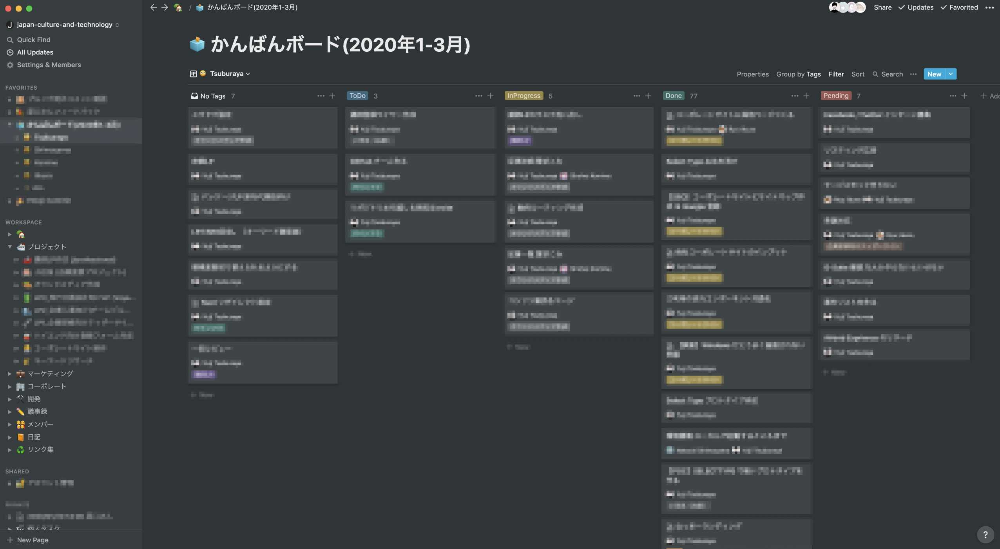
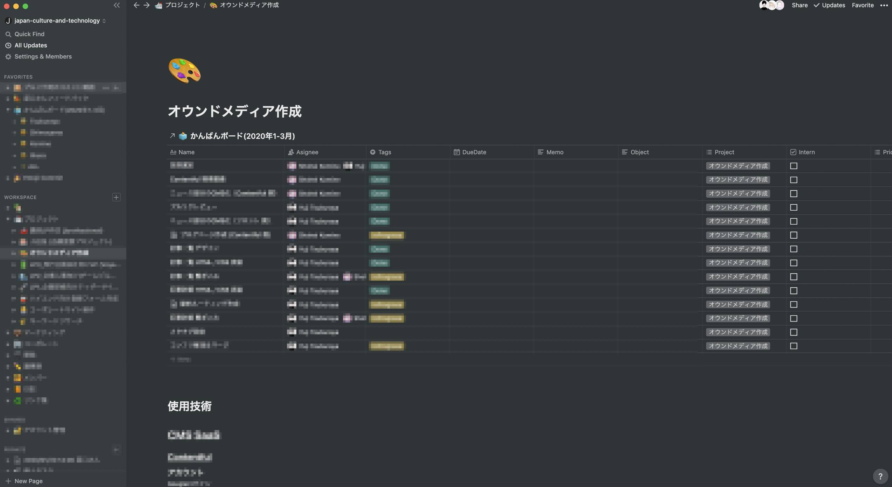
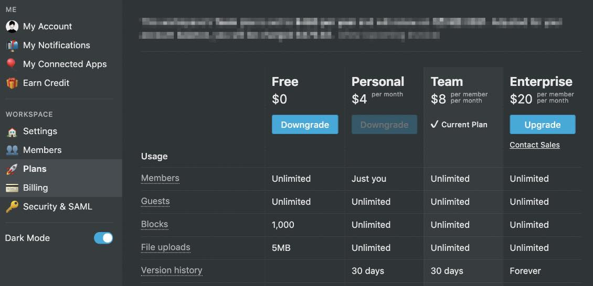

<PostTop />

# Notion を企業のタスク・ドキュメント管理ツールとして運用する

いろんな企業に [Notion](https://www.notion.so) を導入し、
企業のタスク・ドキュメント管理ツールとして Notion を運用するために必要なことが、自分の中に知見として溜まってきたので、
記事化してどなたかのお役に立てればと思い、この記事を書き始めました。

### 想定読者

- 今使っているタスク管理ツール・ドキュメント管理ツールに不満がある
- これから Notion をタスク管理ツールとして導入したいと思っているが、いまいち決めてがない
- ドキュメント管理ツールが煩雑になって困ってしまっている。全然メンテナンスされず形骸化してしまっている

## Notion なら、タスク・ドキュメント管理を 1 つのアプリケーション上で行うことができる

タスク管理は Asana や Trello 、ドキュメント管理は Confluence 、のように、複数のツールを使い分けているというチームも多いのではないでしょうか。
Notion を使えば、タスク管理とドキュメント管理をどちらも Notion 上で行うことが出来ます。
いろんなツールを行ったり来たりする手間が省け、また、Notion 上には常に新鮮な情報が載っている、そんな世界を作ることができると感じています。

---

僕たちのタスク管理の運用をちょっとだけ紹介します。

僕たちの企業では、メンバーごとに今どのタスクを持っているかのかんばんボードと、プロジェクトごとのプロジェクトボードの２つを基本のボードとして運用しています。
メンバーごとの抱えてるタスクを見たい時はかんばんボード、プロジェクトの進捗を見たいときはプロジェクトボードと、
それぞれ使い分けて運用することで、全体の進捗の見える化ができてたいへん便利です。

[Notion + GTD の記事](https://35d.jp/blog/2020-01-18-notion-gtd/) でも書きましたが、
Notion 上のデータベースは 1 つで、色々な切り口でビューを作成できるのが Notion の優れたところだと思っています。

**👆 メンバーごとのかんばんボード(僕が実際に会社で使っているかんばんボードです)**

**👆 プロジェクトごとのプロジェクトボード(僕が実際に会社で使っているかんばんボードです)**

また、1 枚目のサイドバーに注目してもらえると、議事録や技術メモなどのドキュメントも、Notion 上で一伝管理できていることが分かると思います。

これはぼやきですが、社内ドキュメントがなかなか更新されない大きな理由の一つとして、
社内ドキュメントを思い出すタッチポイントが少ないことが挙げられると思っています。
Notion を使って、タスク管理ツールと一緒にしておくことで、
ドキュメントを目にする機会を強制的に増やすことができます（タスク管理ツールは毎日見ますもんね）。

## フロー情報の Slack / ストック情報の Notion

万能ツールに見える Notion ですが、もちろん向いていないこともあります。

発散が目的の議論、リアルタイムなコミュニケーション、新しいアイデアのブレストなんかには向いていません。
こういった揮発性の情報を、**フロー情報**と呼びます。
Notion もリアルタイムで複数人の編集は一応可能ですが、フロー情報の扱いには向いていません。
フロー情報の扱いが得意なのは Slack や Twitter です。

一方で Notion が得意とするのは、**ストック情報**の扱いです。
ストック情報を扱うツールとして求められる要件は、ほしい情報がほしい時にすぐ見つけられること。
Notion には、ページのネスト機能や、クイック検索機能、豊富なビュー、
タイトルの Prefix 絵文字、などがデフォルトで備わっており、ストック情報を扱うツールとしてはうってつけです。
また、非機能面ですが、サクサク気持ちよく動く、というのも Notion は満たしていると感じています。
（Web アプリケーションベースのソフトウェアはサクサク動かないことが多いかなと感じています。）

ストック情報とフロー情報をうまく使い分けましょう。よくありがちなのが、Slack にストック情報をためてしまったりすることです。Slack は検索は一応できますが、情報を引き出すのには向いていません。

## チームプランはちょっとだけお高い

**チームプラン価格表**

デメリット、というほどでもないですが、チームで Notion を運用する場合、月額 **メンバー数 × \$8** の料金がかかります。他のツールよりもちょっと割高かもしれません。

## Notion 導入が銀の弾丸とはならない

さいごに。Notion 導入が銀の弾丸とはなりません。
気軽に書けるがゆえに煩雑になりがちだったり、
情報設計をサボったがゆえに重複した情報が生まれてしまったりすることがあります。

僕の意見としては、階層のルールは誰か一人得意な人（デザイナーが良いと思います）が作り、ルール決めもデザイナーがやると良いと思います。
Notion の機能を徹底的に知り尽くし、情報設計ができるデザイナーを、Notion 整理大臣として任命し、その人が徹底的にメンテナンスするのが良いと思います。
もしくは、みんなで膝を突き合わせて、データ整理の時間を週次で確保したりするのも良いかなと思います。

<blockquote class="twitter-tweet">
俺は……ドキュメント整理大臣になる……！！！！
&mdash; Yuji Tsuburaya (@___35d) <a href="https://twitter.com/___35d/status/1217424317635411969?ref_src=twsrc%5Etfw">January 15, 2020</a></blockquote> 

<blockquote class="twitter-tweet">
ドキュメントちゃんとメンテナンスし続けるという強い意思を持ったドキュメント整理大臣がいないとドキュメント崩壊する。
&mdash; Yuji Tsuburaya (@___35d) <a href="https://twitter.com/___35d/status/1217424364968108034?ref_src=twsrc%5Etfw">January 15, 2020</a></blockquote> 

Notion 導入したいけど整理大臣がいない、とか、Notion 導入したいけど分からないことがある、みたいな方がもしいれば、
Twitter の DM でご相談いただければお手伝いできるところはあるかと思います。
無料・もしくはお気持ち程度の報酬を頂いて、相談乗ります 🙌
