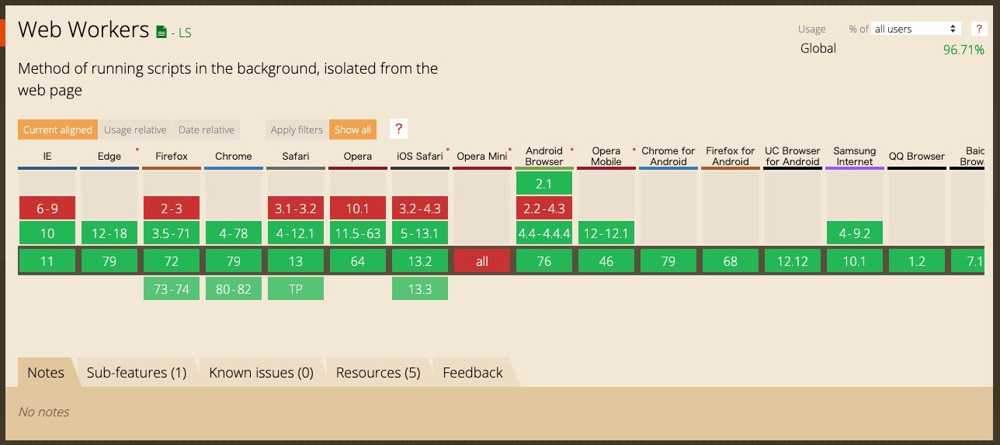
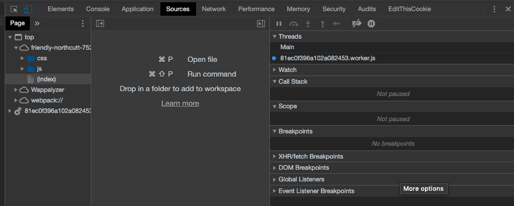

<PostTop />

# Vue.js で WebWorker を使う

とある調査で Vue.js + Web Worker を使用したのでそのメモを残しておきたいと思い、この記事を書き始めました。
Vue.js と馴染ませる上でちょこちょこハマりポイントもあったので、同じところでハマった方の参考になればと思います。

## Web Worker についてと各種ブラウザ対応状況

JavaScript は、何か重い処理（たとえば 3D レンダリングなど）があると、
他の軽い処理をしたい場合でも、動作が重くなってしまうことがあります。
これは、JavaScript が基本的にはシングルスレッドで実行されるという性質によるものです。

Web Worker を用いると、特定のスクリプトを別スレッドで実行することができ、
重い処理をバックグラウンドに逃がしてやることで、他の動作を阻害することなく、快適なユーザー体験を実現することができます。


**(2020/01/27 現在の [CAN I USE](https://caniuse.com/#feat=webworkers)) ほぼ全てのブラウザで対応が完了しています。**

---

少し調査してみたのですが、以下のように Vue となじませるライブラリ（スターもちょこちょこ付いているもの）は世の中に出ていましたが、
ちゃんとメンテナンスされているものは少なそうでした。
なので、ライブラリ使う選択肢はやめて、自前で実装することにしました。

## Vue.js 上で使う場合

`worker-loader` をインストールします。

```bash
$ npm i -S worker-loader
```

`vue.config.js` に以下を追記します。

```js
module.exports = {
  chainWebpack: config => {
    config.module
      .rule("worker-loader")
      .test(/\.worker\.js$/i)
      .use("worker-loader")
      .loader("worker-loader")
      .end();
  }
};
```

別スレッドで実行したい処理をまとめた js ファイルを作成し、 以下のように worker ファイルのインポートを行います。

```js
import Worker1 from "worker-loader!../../js/worker";
```

あとは通常通り `new Worker1()` のようにインスタンスを生成してやれば、別スレッドで処理が行われるようになります。
コンストラクタの引数でファイルパスを指定することも出来るのですが、

## Chrome の検証ツールでの確認方法

ちなみに Chrome の検証ツールだと、`Source` タブの `Threads` から、メインのスレッドとは別にスレッドが立ち上がって処理が行われていることが確認できます。


**Main スレッドとは別にスレッドが立ち上がっていることが確認できる**
