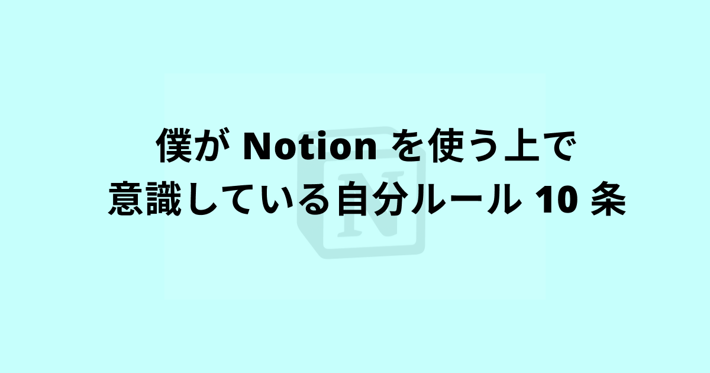
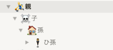
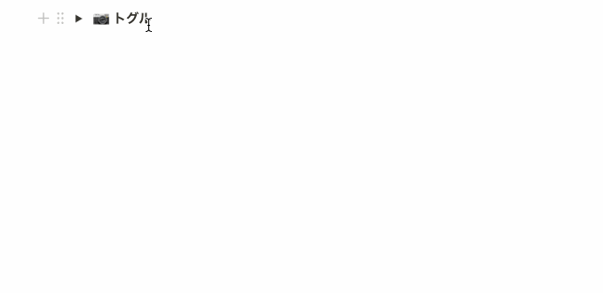
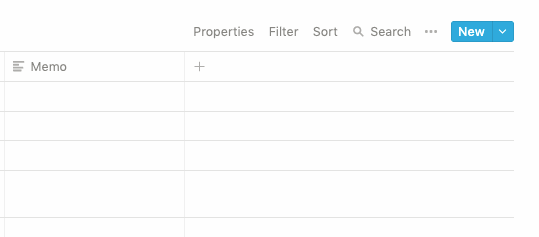
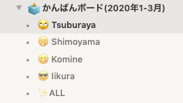
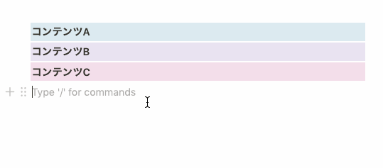
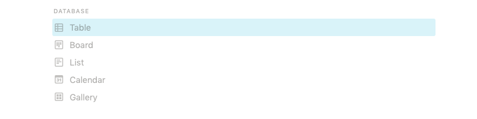
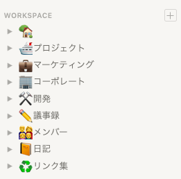
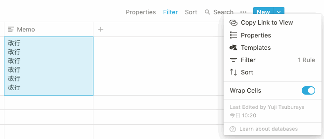

<PostTop />

# 僕が Notion を使う上で意識している自分ルール 10 条

[Notion](https://www.notion.so/) を毎日活用している [@\_\_\_35d](https://twitter.com/___35d) です。
最近、Notion をどのように活用しているのかを聞かれることが多くなってきて、
いつも自分がどのように Notion を使っているのかが体系的に整理されてきた感があるので、
ブログを通してアウトプットしておこうと思い、この記事を書き始めました。

対象読者としては Notion を少しでも使ったことがある方向けです。
まだ一度も Notion に触れたことがないという方は、ぜひ一度自分で使ってみてもらってからこれを読むとさらに理解が深まると思います。

## 1. ページのネストは 3 階層までにする

ページの下にページを作れる（ページのネストができる）というのは、Notion の優れた特徴の一つです。
とても強力な機能ですが、ページのネストをしすぎてしまうと、目的のページにたどり着くまでのクリック数は増え、**さらに情報の一覧性も一気に落ちてしまいます**。

**ページのネストが深すぎる例**

ページのネスト深くなってしまった場合は情報設計に問題がある場合が多いと判断し、Notion の構造を再設計しています。
どのくらいのから深くなったと定義するかは人それぞれですが、
僕は**4 階層以上**になってしまった場合に再設計を行っています。

## 2. 画像を貼る時はトグルを積極的に使用する

縦長の画像を貼ると、Notion のレイアウトの特性上、ページの面積を一気に埋め尽くしてしまいます。
そんな時に便利なのがトグル機能です。トグル機能を使うことで、情報を隠しておくことができます。
画像を貼るときには積極的にトグル機能を使うようにしています。

**Notion トグル機能**

僕の好みですが、トグルのタイトルは太字にし、中にどのような情報が入っているのかを Emoji で表すことが多いです。
例えば、`📷 トグル` といった具合です。Notion でトグル機能を使いたいときは `>` を押したあと `Space` キーを押すとショートカットで入力することができるので、積極的に活用していきましょう。

余談ですが、最近のアップデートでトグル機能の細かい UI 改善も行われて、トグル内に情報があるかどうかがトグル外から分かるようになりましたね。こういうカイゼン素敵だなあと思います。

<blockquote class="twitter-tweet">
Notion アップデートされて、トグル内のコンテンツの有無で &gt; マークの色が変わるようになってる〜！こういう細かい UI 改善好き。 <a href="https://t.co/em4ziFFsfK">pic.twitter.com/em4ziFFsfK</a>
&mdash; Yuji Tsuburaya (@___35d) <a href="https://twitter.com/___35d/status/1230183894684557312?ref_src=twsrc%5Etfw">February 19, 2020</a></blockquote> 

## 3. データベースはフィルタして表示する

データベースのフィルタ機能はとにかく強力です。
スプレッドシートのフィルタのように、データベースに入っている情報をフィルタリングして表示することができます。
フィルタは、表の右上の `Filter` から設定することが出来ます。

**Notion フィルタ機能**

例えば、僕が会社で使用しているタスク用のビューですが、人ごとにフィルタしたビューをそれぞれ準備し、進捗管理を行っていたりします。
人の名前をクリックすると、その人がアサインされているタスク一覧を見ることができるようになります。
その人がどんなボールを持っているかを確認したいときにオススメです。

## 4. 情報量が多いときは横並びレイアウトを使用する

Notion はデザインの都合上、余白が多いデザインとなっています。
もっと余白を有効活用して、画面に入れる情報量を増やしたい、そんなときに役立つのが横並びレイアウトです（正式名称不明）。
下の gif アニメーションのように、ドラッグ＆ドロップで、要素を横並びに配置することができます。
（ショートカットキーでは横並びにすることはできない）

**Notion 横並びレイアウト機能**

これを応用することで、以下のツイートのような、カレンダーのようなビューを自作することができたりします。毎日のメモはこれで取るのがオススメです。

<blockquote class="twitter-tweet">
Notion のカレンダービューがどうも使いづらいと思う方はカレンダーっぽいものを自作するのがオススメ。予定は Google カレンダーで管理してるんだけど、その日にやることや起きたことなどの簡単なメモとかはこっちで管理するようにしてる。 <a href="https://t.co/vowpBnSHfu">pic.twitter.com/vowpBnSHfu</a>
&mdash; Yuji Tsuburaya (@___35d) <a href="https://twitter.com/___35d/status/1227032199817355264?ref_src=twsrc%5Etfw">February 11, 2020</a></blockquote> 

## 5. デフォルトテンプレートで用意されているデータベースページは使用しない

基本的には使わないことをオススメします。
データベースとしてしか使用できないため、
ページに他の要素を入れることもできず、子ページを作成することもできなくなってしまうためです。
使いこなせれば強力なのですが、上のような理由で、初心者の方にはあまりオススメしていません。

 **Notion データベースページ（デフォルトテンプレート)**

もちろんメリットもあり、この機能を使用することで、1 つのデータベースに対し、様々な切り口でビューを複数作成できるようになります。
上で紹介した人ごとにフィルタしたビューを複数準備したい、というときにはデータベースページを使うと良いです。

**（再掲：アサインごとでフィルタしたビュー）**

## 6. 情報を重複させない

別のページに同じ情報が入ると二重メンテの必要が出てきてしまいます。
同じ情報は必ず一箇所にまとめるようにしましょう。
同じ情報が複数ページにまたがりそうなときは、情報設計に問題がある場合が多いので、設計を見直してみることをオススメします。

これに関しては [Notion と DRY 原則](https://35d.jp/blog/2020-01-30-notion-dry/)というブログを書いたので、
ぜひこちらも合わせてお読みいただければと思います。

## 7. INBOX に情報を集約する

完全に好みですが、僕は、頭の中に浮かんだものを全て INBOX に入れるという運用を行っています。
直近やらなければならないことや、中長期的にやるべきことなど、
頭に思いついたことを全て INBOX に入れて、後で今やるべきことは何なのかを
振り分ける GTD という手法を使っています。

詳しくは、[Notion + GTD でストレスフリーな生活を手に入れる](https://35d.jp/blog/2020-01-18-notion-gtd/)というブログを書いたので、ぜひこちらもお読みいただければと思います。

<blockquote class="twitter-tweet">
Notion API 叩いてメモを INBOX に追加するためだけの iPhone アプリ作りたい機運が高まってる。Captio みたいなイメージで。
&mdash; Yuji Tsuburaya (@___35d) <a href="https://twitter.com/___35d/status/1229214457923981312?ref_src=twsrc%5Etfw">February 17, 2020</a></blockquote> 

**💭 簡単に INBOX にメモを追加できるアプリ開発を始めました**

## 8. ページには Emoji を必ず設定する

Notion はページの Prefix に Emoji を設定できるというユニークな機能があります。僕は Emoji が大好きなので、必ず Emoji を付けるようにしています。
Emoji を使うことによって、視認性が格段に上がることのほか、
人間の脳は文字よりもビジュアルを記憶しておきやすいので、どこに何の情報が入っているのかを思い出すフックにもなりやすくなります。
何より、自分が付けた Emoji だと愛着がわきますよね。

**なるべくページのタイトルと近い Emoji を選ぶようににしていますが、該当するのがない時は Notion がランダムに選んだものを適当に付けてますｗ**

**Emoji ページには Emoji を必ず設定する**

## 9. テーブルビューは Wrap Cells する

お恥ずかしながら最近まで知らなかったのですが、テーブルビュー内で折返しをしたいときの設定ができます。
設定を ON にすることで、テーブル内の要素が改行できるようになります。改行は `Shift` + `Return(Enter)` ですることができます。

**テーブルビューは Wrap Cells する**

2020/02/24 時点でデフォルト設定を ON にできないので、デフォルト ON にできるようにしてほしいです Notion さん……
OFF にしたいシーンが今までで一回もなかったので……

<blockquote class="twitter-tweet">
Notion の Wrap Cells オプション、OFF にしたいシーンが一切ないから、デフォルト ON にできるようにしてほしい……毎回 ON に変更してる気がする。 <a href="https://t.co/5U1yOKrZQ9">pic.twitter.com/5U1yOKrZQ9</a>
&mdash; Yuji Tsuburaya (@___35d) <a href="https://twitter.com/___35d/status/1231751425710948353?ref_src=twsrc%5Etfw">February 24, 2020</a></blockquote> 

## 10. 完璧を目指しすぎない

最後になりますが、最初から完璧な設計はできません。日々改善していくというマインドで臨むのがオススメです。
最初から完璧にしようとしすぎると、かえって自分の首を締めてしまい、Notion が楽しくなくなってしまいます。
僕も頻繁に設計を変えていて、日々改善を繰り返しています。最初にした設計が跡形もなく消えることも頻繁にあります。
ぜひ気軽な気持ちで使ってみてください。

とはいうものの、どういう設計にしたら良いか悩む場合もあると思うので、
そんなときは Twitter の DM 等で僕の方までお気軽にご相談いただければと思います。
アドバイスはできると思います。

---

ということで、最後までお読みいただきありがとうございました。
それではみなさん、良い Notion ライフを。
