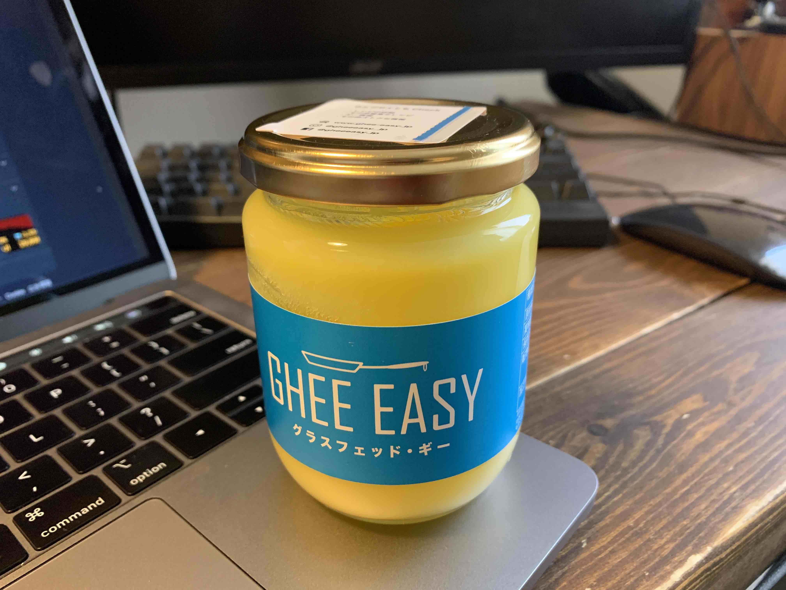

<PostTop />

# ギーを購入した

バターコーヒー用に[ギー](https://amzn.to/2IWfiCS)を購入しました。
今まで KALDI でグラスフェッドバターを購入してバターコーヒーを作っていたのですが、
いつの間にか入荷されなくなってしまったようで（店員さんに聞いても「何それ？」って言われて）、
しぶしぶ Amazon でギーを購入しました。

以下ギーにして良かったところ、微妙だったところの所感です。

## よかったところ

- 今まではグラスフェッドバターを 10g ずつカットして冷蔵保存するという手間が省けるようになった
- Amazon で買えてリピートしやすくなった

## 微妙だったところ

- バターコーヒーの風味はグラスフェッドバターの方が良かった気がする
- コスパが微妙（ちょっとお高い）

---

- [バターコーヒー生活はじめました](/blog/2020-01-05-butter-coffee/)
- [ギー | Amazon](https://amzn.to/2IWfiCS)
