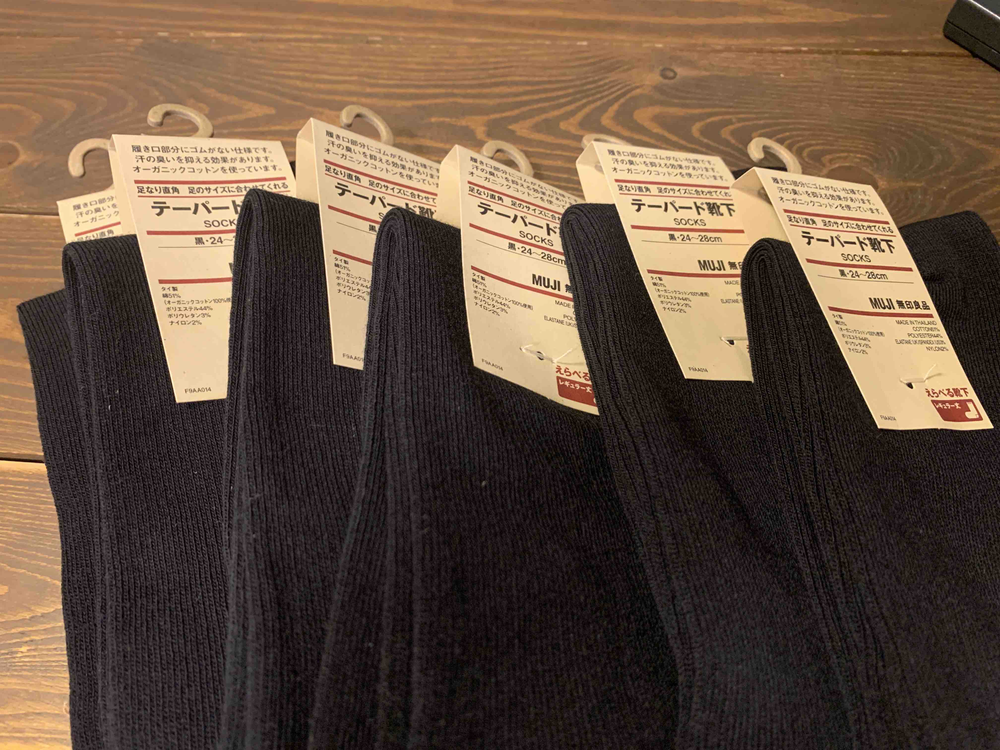

<PostTop />

# 無印良品で、下着・靴下のまとめ買いをした

下着と靴下は無印良品のものを学生の頃から使い続けています。
半年に一度くらい定期的に入れ替える（全て捨てて、全て買い直す）ことをしていて、
ちょうど無印良品週間もやっていて良いタイミングだったので、まとめて買い替えました。

靴下を 6 足と、下着を 6 枚購入。
定期的に全て買い直すと、気持ちもリフレッシュされてスッキリします。

また半年後に。

---

2020 年春の無印良品週間は、4/7 まで開催しているそうなので、お求めのものがある方はぜひ。

<blockquote class="twitter-tweet">
【無印良品週間】4月7日（火）まで開催 無印良品メンバーの皆さまの新生活を応援する「無印良品週間」を、4月7日（火）まで開催しています。 期間中、MUJI passport アプリやクーポンメールの提示で10％OFFです。（ネットストア含む） ※他の割引との併用はできません <a href="https://t.co/rEwU3qgPj7">https://t.co/rEwU3qgPj7</a>
&mdash; 無印良品 (@muji_net) <a href="https://twitter.com/muji_net/status/1240885784556773377?ref_src=twsrc%5Etfw">March 20, 2020</a></blockquote> 
